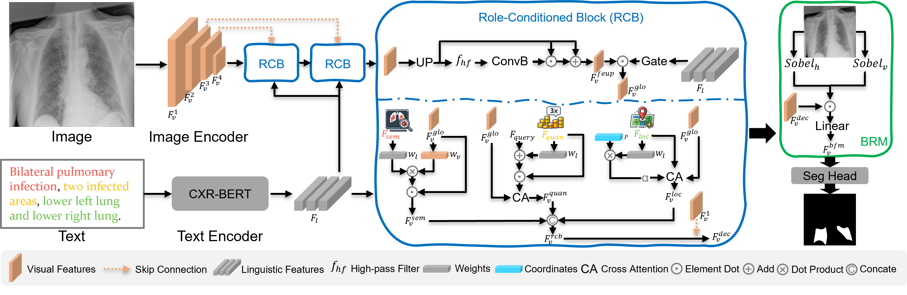
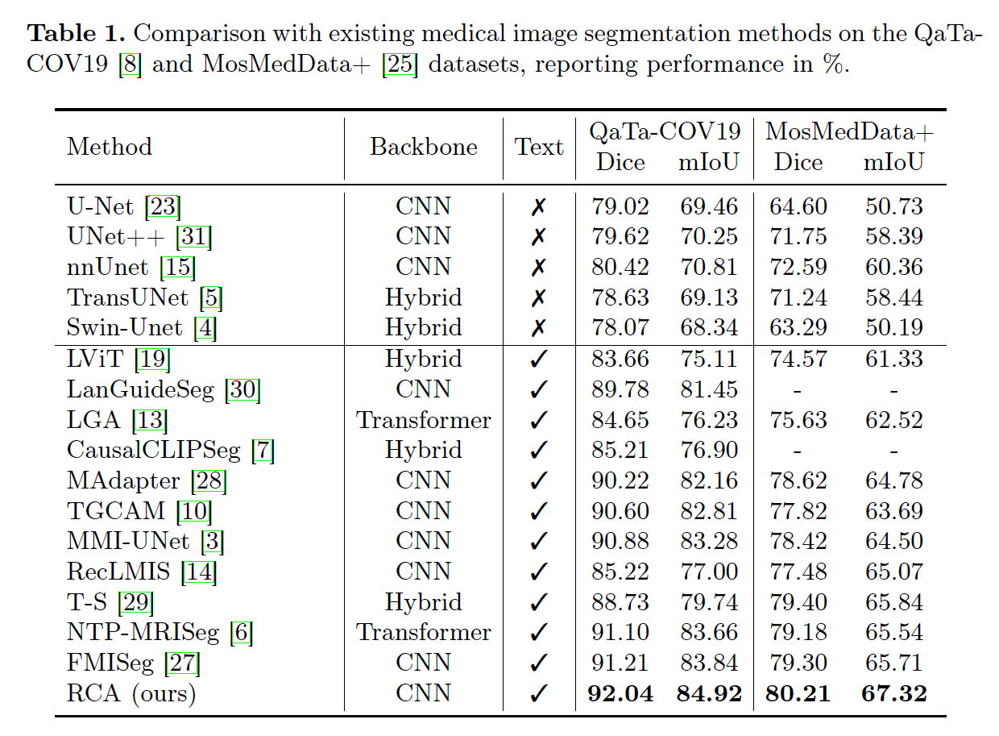
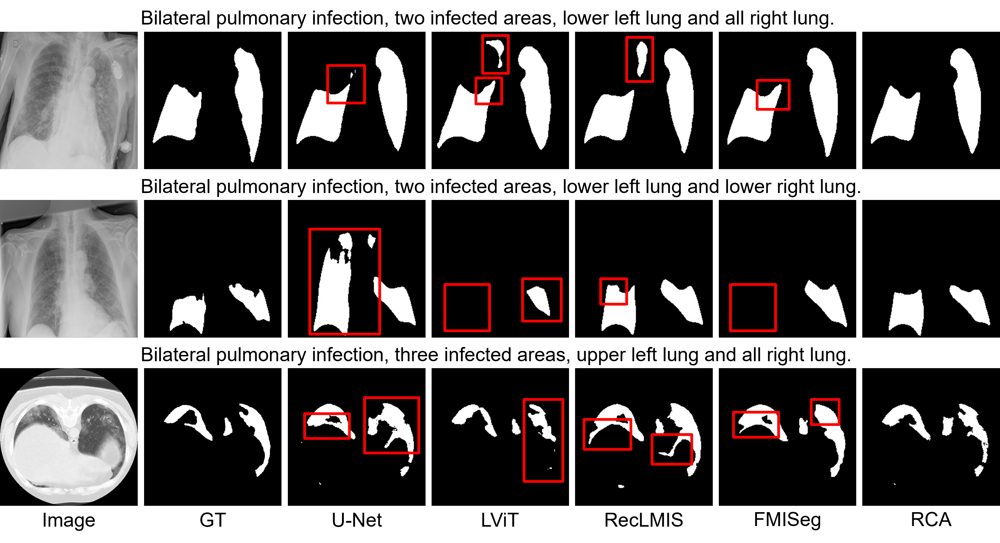

<div align="center">
<h3>
Learning Role-Conditioned Alignment for Medical Image Referring Segmentation

</h3>

Kun Li<sup>1</sup>, 
Fu Wang<sup>1</sup>,
Feixiang Zhou<sup>1</sup>, 
He Zhao<sup>1</sup>,
Xiaowei Xu<sup>2</sup>, 
Yanda Meng<sup>3</sup>,
Yitian Zhao<sup>4</sup>, 
Yalin Zheng<sup>1</sup>, 

<sup>1</sup>University of Liverpool, UK, 
<sup>2</sup>Leibniz Institute for Analytical Sciences, Germany,
<sup>3</sup>King Abdullah University of Science and Technology, Saudi Arabia,
<sup>4</sup>Chinese Academy of Sciences, China

⭐ **Early accepted, MICCAI 2026 Spotlight**⭐


</div>

<!--  -->


## Framework


## Requirements
1. Environment  
The main mandatory dependency versions are as follows:  
    ```
    python=3.8.20  
    torch=1.12.1  
    torchvision=0.13.1  
    pytorch_lightning=1.9.0  
    torchmetrics=0.10.3  
    transformers=4.24.0  
    monai=1.0.1  
    pandas=2.0.3
    numpy=1.24.4
    matplolib=3.7.5
    opencv-python=4.13.0.90
    scikit-image=0.21.0
    tokenizers=0.13.3
    tqdm=4.67.1  
    einops=0.8.1  
    ```

2. Download the pretrained model of CXR-BERT and ConvNeXt
   
   CXR-BERT-specialized see: https://huggingface.co/microsoft/BiomedVLP-CXR-BERT-specialized/tree/main  
   ConvNeXt-tiny see: https://huggingface.co/facebook/convnext-tiny-224/tree/main

   Download the file 'pytorch_model.bin' to './lib/BiomedVLP-CXR-BERT-specialized/' and './lib/convnext-tiny-224'  
   If you want to use local model, just change the `bert_type` and `vision_type` in `/config/training.yaml` to local filefold path.
   ```
   ...
   MODEL:
     bert_type: ./lib/BiomedVLP-CXR-BERT-specialized
     vision_type: ./lib/convnext-tiny-224
   ...
   ```
   
   Or just use these models online:
   ```
   url = "microsoft/BiomedVLP-CXR-BERT-specialized"
   tokenizer = AutoTokenizer.from_pretrained(url,trust_remote_code=True)
   model = AutoModel.from_pretrained(url, trust_remote_code=True)
   ```
   

## Dataset
1. QaTa-COV19 Dataset(images & segmentation mask)  
    QaTa-COV19 Dataset See Kaggle: [https://www.kaggle.com/datasets/aysendegerli/qatacov19-dataset](https://www.kaggle.com/datasets/aysendegerli/qatacov19-dataset)

    **We use QaTa-COV19-v2 in our experiments.**

2. QaTa-COV19 Text Annotations(from thrid party)  
    Check out the related content in LViT: [https://github.com/HUANGLIZI/LViT](https://github.com/HUANGLIZI/LViT)


## QuickStart
Coming soon.

## Result





## Citation

If you find our work useful in your research, please consider citing:
```
@InProceedings{LiKun_Learning_MICCAI2026,
        author = { Li, Kun AND Wang, Fu AND Zhou, Feixiang AND Zhao, He AND Xu, Xiaowei AND Meng, Yanda AND Zhao, Yitian AND Zheng, Yalin},
        title = { { Learning Role-Conditioned Alignment for Medical Image Referring Segmentation } },
        booktitle = {Medical Image Computing and Computer Assisted Intervention -- MICCAI 2026},
        year = {2026},
        publisher = {Springer Nature Switzerland},
        volume = {LNCS 16883},
        month = {September},
        page = {pending}
}
```

